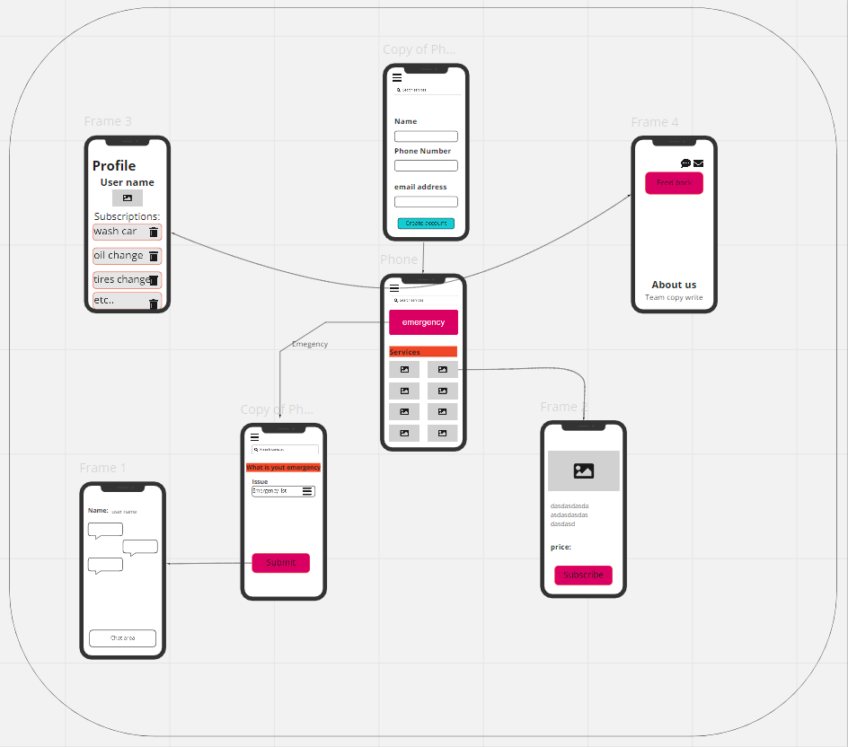
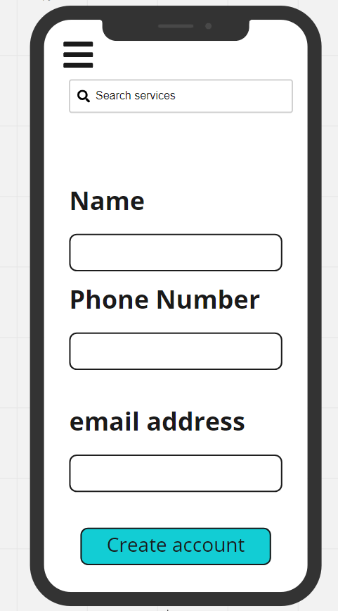
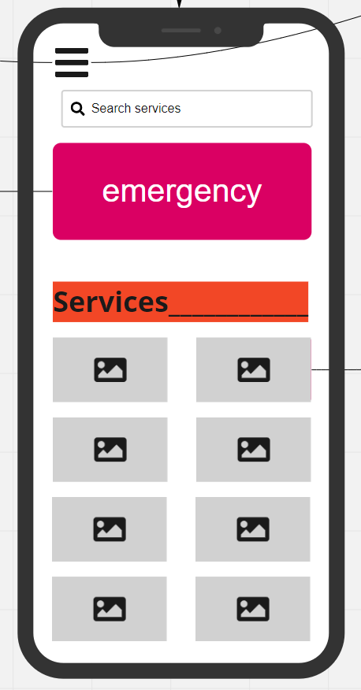
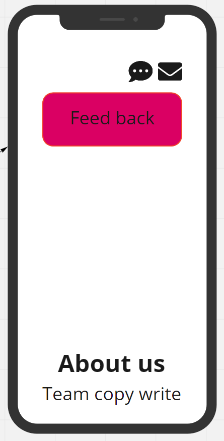
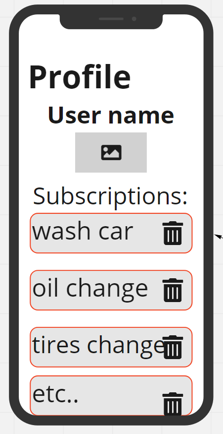
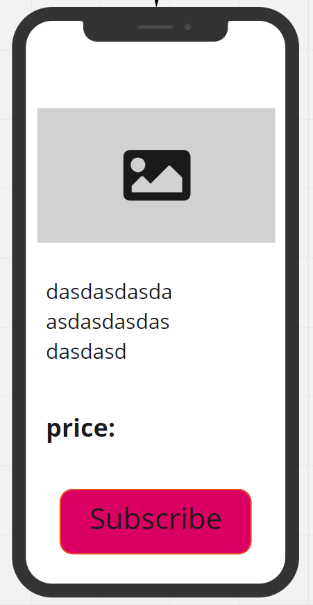
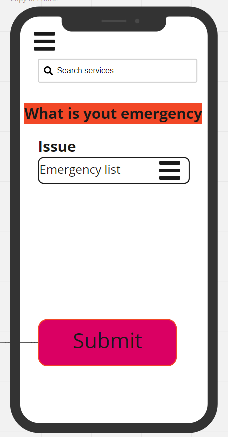
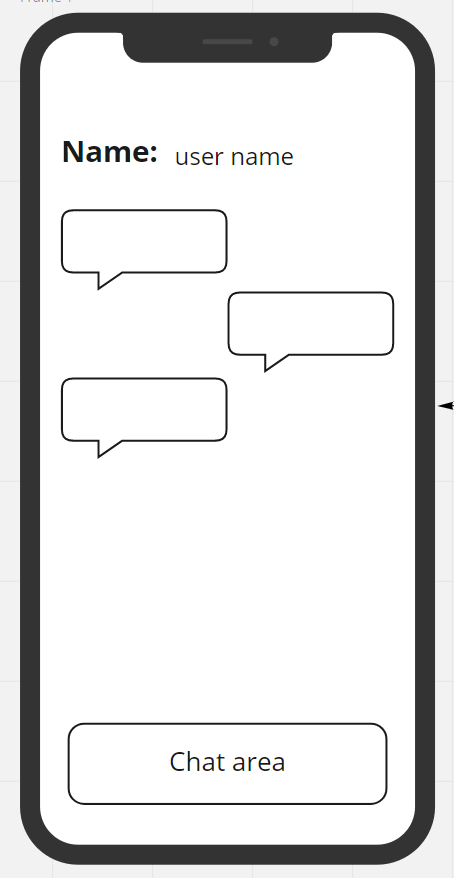

# Garage-Mobile-backend

# Authors:
- Essam Omar

- Omar Humamah

- Dima Al-Absi

- Aseel Al-Asaad

- Rami Zregat

---

# Project Description:
- It is an application that supports the user to easily access services related to his car in case of emergency and others.

- This app using real-time events for executing, and presenting an application that showcases an event driven architecture. programming concepts:
 A “hub” server that moderates all events.
 Multiple “clients” that connect to the hub which can .both publish and subscribe to events
 Must operate over a network.

---

# Wireframe:

---

## Login

---

## Home Page

---
## About Us

---
## Profile

---
## Service

---
## Emergency

---
## Chat

---

# Dependencies:  

- cors
- bcrypt
- base-64
- dotenv
- express
- jest
- supertest
- pg
- sequelize
- sequelize-cli
- sqlite3

---

<!-- # How to start the server:  
- pgstart
- npm start -->

<!-- # UML: -->